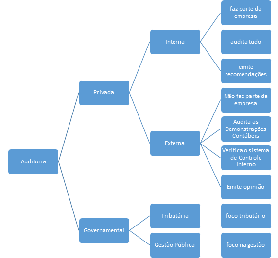

# Auditoria
*Este é um resumo esquematizado de auditoria*

## Conceito

Auditoria é uma técnica contábil surgida da necessidade de garantir a veracidade das informações derivadas dos registros contábeis.

Ela consiste na verificação da exatidão e fidedignidade dos dados contidos nas demonstrações contábeis por meio do exame minucioso dos registros da contabilidade e dos documentos que lhes deram origem.
A auditoria confronta o que deveria ser com aquilo que efetivamente é, e encontrando diferença (distorção), emite uma opinião.

## Tipos

*Diagrama dos tipos de auditoria - elaborado pelo autor.*

## Diferença entre a Auditoria Interna e Externa

Auditoria | Interna | Externa
--------- | ------- | -------
**Sujeito** | funcionário da empresa | profissional independente/firma de auditoria
**Ação e Objetivo** | exame dos controles e da gestão | exame das demonstrações contábeis
**Finalidade** | promover melhoria nos controles e na gestão | opinar sobre as demonstrações contábeis
**Foco do relatório** | recomendações | parecer/opinião
**Grau de independência** | menor | maior
**Interessados** | administração da empresa | empresa e público em geral
**Responsabilidade** | trabalhista | profissional, civel e criminal
**Continuidade do trabalho** | contínuo | periódico

## Características da Auditoria

### Interna

* menor independência (dependência);
* trabalho contínuo;
* maior número de testes;
* assessoria da administração;
* foco nos processos;
* emite recomendações.

### Externa

* maior independência;
* trabalho periódico;
* menor número de testes;
* foco nas demonstrações contábeis;
* emite parecer/opinião.

--------

# Auditoria Interna

**Atividade de avaliação independente dentro da empresa para verificar as operações e emitir uma recomendação sobre elas.**

## Objetivo

Serve para auxiliar a administração da entidade no cumprimento de seus objetivos, não tendo como objetivo principal a identificação de fraudes e erros ou a punição de gestores que cometeram irregularidades.

## Requisitos de autonomia

A Auditoria Interna deve ter autonomia para:

* decidir o que e quando auditar;
* decidir como auditoar;
* decidir quais recomendações incluir no relatório.

## Papeis ou Funções

* auxiliar a administração da entidade no cumprimento de seus objetivos, identificando oportunidades e estratégias para minimizar riscos inerentes à atividade da organização da qual faz parte;
* assessorar a administração da entidade na prevenção de fraudes (intencional/dolo) e erros (não intencional/culpa) informando-a por escrito e reservadamente quaisquer indícios de irregularidades detectados no decorrer do trabalho de auditoria.
